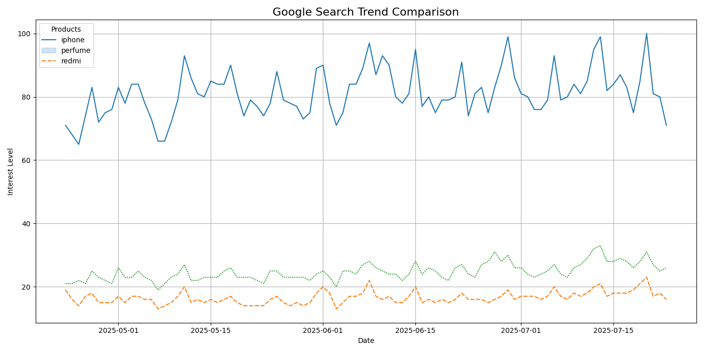

Search Trend Analyzer

A real-time Google Trends analyzer that compares the popularity of products over time using the `pytrends` API.

---

Features

- Compare up to 5 keywords/products
- Real-time data using Google Trends API
- Interactive visualizations with Matplotlib & Seaborn
- Displays the last 5 days’ interest + trend chart

---

Tech Stack

- Python
- Google Colab
- PyTrends
- Pandas, Matplotlib, Seaborn

---

Output Example

---

How to Use

1. Open the notebook `search_trend_analyzer.ipynb` in Colab
2. Run all cells
3. Enter keywords when prompted
4. View trend chart + real-time data table

---

Dataset

Data is fetched live from **Google Trends** based on user input.

---

